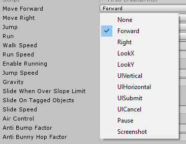

# Rewired Inspector Properties

A set of inspector-editable types that help with safely and efficiently working with [Rewired](https://assetstore.unity.com/packages/tools/utilities/rewired-21676) input actions. Designed as a modern Unity package.

For use with Unity 2019.2+



# Usage

The editable type is `RewiredAction` in the `Valax321.RewiredActionProperty` namespace. When this is used as a SerializedField in a inspectable class, the actions available in your RewiredConsts generated file will be listed as input actions in the drop-down for the field. This allows for non-programmers to mix and match input actions without touching the code or using strings that can't be validated beforehand.

The field can then be used to check input. As an example:
```csharp
// Use the correct namespace
using Valax321.RewiredActionProperty;

...

// Member variable declarations
[SerializeField] private RewiredPlayer m_playerID;
[SerializeField] private RewiredAction m_jumpAction;
private Rewired.Player m_player;

...

// Setup the player
m_player = ReInput.players.GetPlayer(m_playerID);

...

// Somewhere in your code
bool isJumping = m_player.GetButtonDown(m_jumpAction); // RewiredAction automatically casts to int so it can be used transparently
```

By default RewiredAction looks for inputs in the RewiredConsts.Action class within `Assembly-CSharp.dll`. If you have a non-standard name or assembly location for your RewiredConsts, you can change the class used for the input listing in your project settings. The inspector will tell you if the class cannot be found so it will be obvious if this needs to be done.

## License
MIT license. See LICENSE for more.