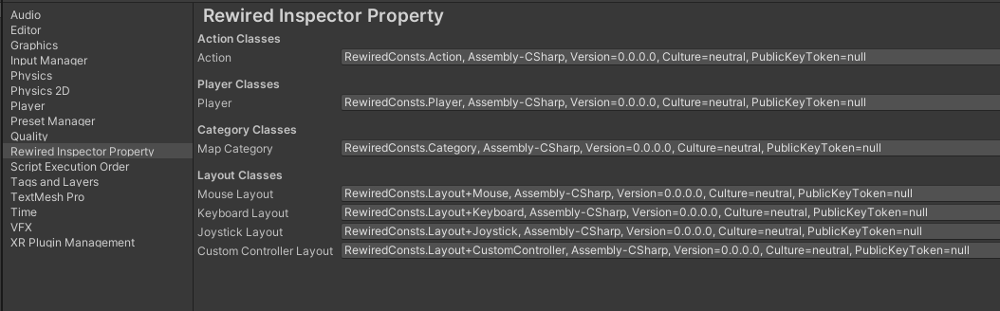

# Rewired Inspector Properties

[](https://openupm.com/packages/com.valax321.rewiredinspectorproperty/)


A set of inspector-editable types that help with safely and efficiently working with [Rewired](https://assetstore.unity.com/packages/tools/utilities/rewired-21676) input actions. Designed as a modern Unity package.

For use with Unity 2019.2+


# Usage

This package provides a number of property types that can be used to setup input through the Unity editor UI in a safe and efficient manner.

| Type | Description |
| ---- | ----------- |
| RewiredAction | Used for input actions. |
| RewiredPlayer | Used for player setups. |
| RewiredMapCategory | Used for input map categories. |
| RewiredMouseLayout | Used for mouse layouts. |
| RewiredKeyboardLayout | Used for keyboard layouts. |
| RewiredJoystickLayout | Used for joystick layouts. |
| RewiredCustomControllerLayout | Used for custom layouts in Rewired's custom controller feature. |

These properties can then be used programatically with Rewired in C#. As an example:
```csharp
// Use the correct namespace
using Valax321.RewiredActionProperty;

...

// Member variable declarations
[SerializeField] private RewiredPlayer m_playerID;
[SerializeField] private RewiredAction m_jumpAction;
private Rewired.Player m_player;

...

// Setup the player
m_player = ReInput.players.GetPlayer(m_playerID);

...

// Somewhere in your code
bool isJumping = m_player.GetButtonDown(m_jumpAction); // RewiredAction automatically casts to int so it can be used transparently
```

By default the properties look for Rewired information in the generated RewiredConsts file within the `Assembly-CSharp.dll` namespace. If you have a non-standard name or assembly location for your RewiredConsts, you can change the class used for the input listing in your project settings. The inspector will tell you if the class cannot be found so it will be obvious if this needs to be done.



## License
MIT license. See LICENSE for more.